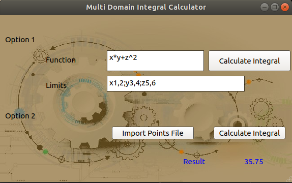

This tool calculates multiple integrals using numerical methods (Trapezoidal, Simpson 1/3, Simpson 3/8).
Two options:
1. Input the function and the limits fir each variable.
2. Import a file with value points for each variable and the function value at each of them.
Example:

